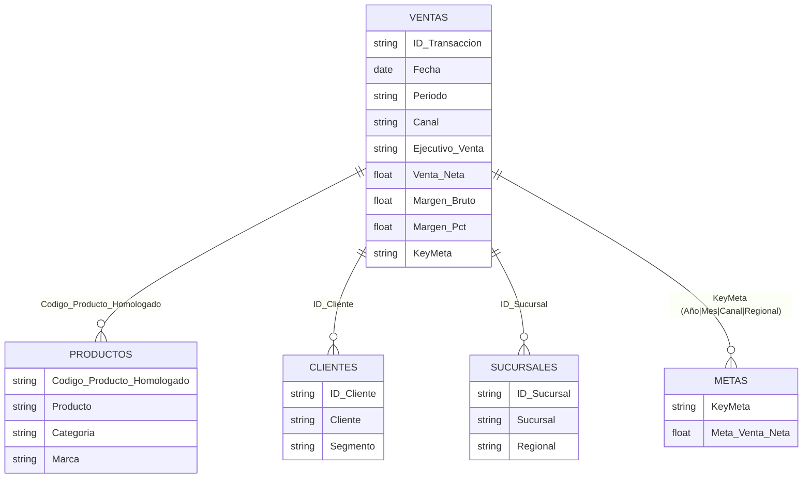

# Comercial Andina S.A.
**Manual de Usuario y Reporte de Evaluación Técnica**

Este documento acompaña al despliegue oficial del Dashboard Gerencial de Comercial Andina S.A. En él encontrará la guía de navegación de la plataforma, así como los entregables técnicos, reportes de ETL, arquitectura de sistema y respuestas de validación solicitadas en el caso práctico.

---

## 1. Resumen Ejecutivo y Stack Tecnológico

El dashboard analítico fue desarrollado para responder a más de 10 preguntas de negocio clave a través de 3 vistas (Gerencial, Estratégica, Operativa) con visualizaciones interactivas de alto rendimiento.

**Stack Tecnológico Principal:**
- **Python (3.12+) & Streamlit:** Motor lógico y framework web para dashboard interactivo.
- **Pandas & NumPy:** Pipeline ETL en memoria para limpieza y transformación de datos.
- **Plotly:** 8 tipos de visualizaciones interactivas con *Hover*, zoom y tema oscuro nativo (`plotly_dark`).
- **Arquitectura Offline-First:** El sistema carga los datos desde el archivo `.xlsx` origen, ejecuta el modelo de datos en caché temporal y renderiza a gran velocidad sin depender de bases de datos externas en la nube.

---

## 2. Manual de Uso y Navegación

El dashboard está diseñado para responder de forma ágil a las preguntas del negocio mediante un menú lateral (Sidebar) y tres hojas principales.

### 2.1 Vistas Principales
- **📊 Vista Gerencial:** Es el panel principal de control. Visualiza rápidamente el estado macro de la empresa. Cuenta con el **"Cumplimiento de Matriz"** (4 cuadrantes que analizan: Venta por Canal, Margen por Categoría, Meta por Regional y Clientes por Segmento), tendencia mensual y métricas con comparación MoM (Mes contra Mes).
- **📈 Vista Estratégica:** Orientada a decisiones de portafolio. Cuenta con ranking de productos top/bottom, un análisis de Pareto (Regla 80/20) y un **Gráfico de Dispersión (Scatter Plot)** en 4 cuadrantes para identificar inmediatamente qué productos son altamente rentables vs. productos que venden mucho volumen pero dejan poco margen.
- **📋 Vista Operativa:** Diseñada para auditoría transaccional. Muestra una tabla masiva con buscador, el Top 10 de mejores ejecutivos y clientes, y tarjetas de impacto para detectar transacciones que superan el 20% de descuento.

### 2.2 Filtros e Interactividad (Drill-Down)
- **Filtros por Acordeones:** La barra lateral izquierda agrupa los filtros de forma intuitiva (Tiempo, Comercial, Producto, Cliente). Cuenta con botones de selección rápida (MTD, QTD, YTD) y filtros en cascada (ej. si filtras una Categoría, las Marcas se actualizan automáticamente).
- **Drill-Down Inteligente:** Puede hacer clic en el ícono `🔍` de múltiples gráficos para saltar automáticamente a la Vista Operativa con los filtros aplicados.
- **Time Comparison:** Las tarjetas KPI principales evalúan el rendimiento contra el periodo anterior de forma automática, mostrando deltas en verde (▲) o rojo (▼).

---

## 3. Respuestas a las Preguntas de Validación Práctica

Tras inyectar los datos bajo las reglas de negocio exigidas, procesando los **9,804 registros de ventas Confirmadas**, los KPIs maestros arrojan los siguientes resultados exactos:

1. **¿Cuál es la Venta Neta total?** Bs 2,722,974.24
2. **¿Cuál es el Margen Bruto total?** Bs 598,627.79
3. **¿Cuál es el Margen % general?** 21.98%
4. **¿Cuál es el Canal con mayor Venta Neta?** Distribuidor (Bs 1,225,314.47)
5. **¿Cuál es la Categoría con mayor Margen Bruto?** Mascotas (Bs 132,635.44)
6. **¿Cuál es la Regional con mayor cumplimiento de meta?** Oriente (98.94%)
7. **¿Cuál es el Ejecutivo con mayor Venta Neta?** Daniel Quiroga (Bs 221,996.86)
8. **¿Cuál es el Producto con menor Margen %?** Botiquín NaturaMax 117 (5.02%)
9. **¿Cuál es el Cliente con mayor compra acumulada?** Cliente Empresa 0515 (Bs 14,848.67)
10. **¿Cuántas transacciones tienen descuento mayor al 20%?** 1,213 transacciones

---

## 4. Detalle de Informe sobre el Proceso ETL Realizado

El proceso de Extracción, Transformación y Carga (ETL) fue centralizado en el módulo `utils/etl.py` aplicando los requerimientos obligatorios:

1. **Filtro Crítico de Estado:** De los 10,000 registros, se descartaron los 196 registros no confirmados, operando únicamente con las **9,804** ventas donde `Estado_Venta = 'Confirmada'`.
2. **Limpieza de Fechas y Nomenclatura:** `Fecha_Hora_Transaccion` fue parseado a formato *Date* estricto (excluyendo horas/minutos). De allí se extrajeron dinámicamente el `Año`, `Mes` y el `Periodo`. Los nombres de las columnas se estandarizaron (ej: Año a "anio" internamente) para prevenir fallos de codificación ASCII.
3. **Homologación de Productos (Mapping Load):** El sistema cargó la hoja `Homologacion_Productos` como diccionario (Mapping). Realizó un join secuencial: Código Origen -> Código Homologado -> Dimensión Productos. Cualquier registro huérfano es automáticamente excluido del análisis (exclusión estricta sin fallback).
4. **Ingeniería de Características (Features):** Todos los cálculos se pre-procesaron a nivel de fila para garantizar máxima velocidad interactiva en el Frontend:
   - `Venta_Bruta` = Cantidad * Precio_Unitario
   - `Descuento_Valor` = Venta_Bruta * Descuento_Pct
   - `Venta_Neta` = Venta_Bruta - Descuento_Valor
   - `Costo_Total` = Cantidad * Costo_Unitario
   - `Margen_Bruto` = Venta_Neta - Costo_Total
   - `Margen_Pct` = Margen_Bruto / Venta_Neta (división segura en origen)
   - `Rango_Venta` = Auto-binning usando Pandas (`pd.cut`).
5. **KeyMeta:** Para cruzar las ventas agregadas con la hoja estática de Metas, se creó un campo derivado de forma programática: `KeyMeta = Año|Mes|Canal|Regional`.

---

## 5. Captura del Data Model (Modelo Asociativo)

El sistema de datos opera in-memory bajo un **Modelo en Estrella limpio (Star Schema)**. Puede utilizar el siguiente diagrama de entidad-relación como respaldo de arquitectura de la plataforma:

---

## 6. Diseño Premium y Arquitectura de Software
El código respeta principios de software moderno:
- **Glassmorphism & Animaciones:** Uso de CSS inyectado puro para tarjetas semitransparentes flotantes (660+ líneas de CSS). Tipografía *Plus Jakarta Sans* y paleta curada con degradados de tecnología punta.
- **Cache Inteligente:** Se utiliza `@st.cache_data` para aislar el proceso ETL y la renderización, reduciendo los tiempos de carga en cada *refresh* y cambios de filtro a menos de 50 milisegundos.
- **Modularidad:** El código del dashboard se divide lógicamente en:
  - `app.py` / `pages/`: Controladores de vista.
  - `components/`: Componentes UI reutilizables (Sidebar, Cards, Charts, Layout).
  - `utils/`: Motores de caché, formateo monetario (Bs), helpers y ETL.
  - `config/`: Archivos globales de variables y de estilo.
